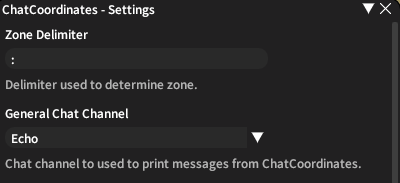
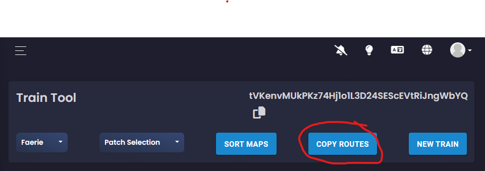
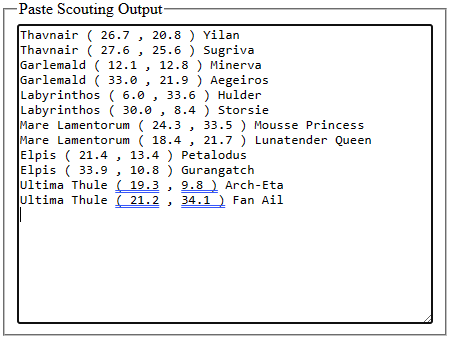
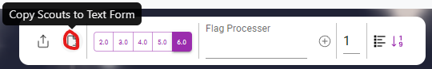
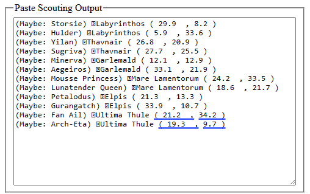
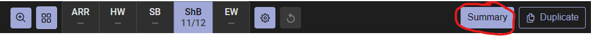
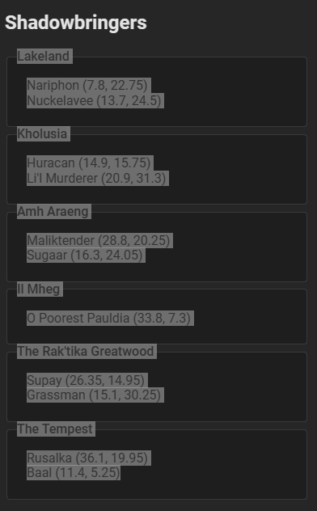
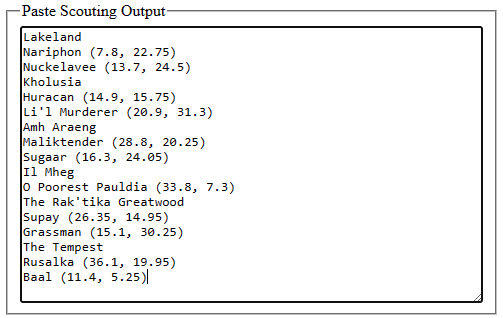

# FFXIV Hunt Trains - Conductor Helper

A quick and simple tool for FFXIV hunt train conductors to get their flags ready for an upcoming train. 
It will take text scouting reports/summaries from [BearTracker](https://aetherhunt.beartoolkit.com/train), 
[SirenHunts](https://sirenhunts.com/scouting), or 
[PrimeHunts](https://prime-hunt-tools.web.app/), and will properly format the output into an FFXIV macro
that will output all of the marks as clickable flags in your echo log.

To use this tool, you must have installed [XIVLauncher](https://goatcorp.github.io/) and enabled the [ChatCoordinates](https://github.com/kissorjeyabalan/dalamud-chatcoordinates) plugin.

*(ChatCoordinates is a simple tool that allows you to use the /coord command with x/y coordinates and a map name to set a flag and, optionally, echo the clickable flag link in your echo output, e.g. `/coord 26.7 20.8 : Thavnair`).  It does not auto-teleport, or do anything other than turn text coordinates into a flag and a clickable map link.*

## Basic How-To

1. [Open Conductor Helper](https://wexxlee.github.io/conductor-helper/)
2. Enter a train name, and select the scouting site you are using.
3. Paste the scouting report (see [below](#exporting-scouting-reports))
4. Click 'Output Macro'
5. Copy the generated macro text to a new macro in FFXIV, and run it.
6. Profit.

## Details

### Setting up ChatCoordinates

Once installed, you can use the default options in ChatCoordinates without any additional configuration.  However, if you have your 'Battle' tab set to show only echo messages (to enable you to quickly set flags during a train), I recommend configuring ChatCoordinates to have it send your flags directly to your echo log, like so:

### Exporting Scouting Reports

#### BearTracker

Use the `Copy Routes` button to export the route to your clipboard, and paste it into the Conductor Helper form:

#### Siren Hunts

Use the `Copy Scouts to Text Form` button to export the route directly to your clipboard, and paste it into the Conductor Helper form:

#### Prime Hunts

Use the `Summary` button, and manually copy the zone names and mark info from the side panel into the Conductor Helper form:

*(Note: This format is slightly different than the other two sites, with the zone name on a line by itself above that zone's marks, but the Conductor Helper tool expects & handles this.)*

## Issues & Suggestions for Improvement

Please use the `Issues` tab at the top to report any issues with the tool or suggest additional features (or if there are other scouting sites that should be supported!)

## Licensing, Trademarks, Copyright

This project is open source under the [Apache License, Version 2.0](LICENSE).

FINAL FANTASY is a registered trademark of Square Enix Holdings Co., Ltd.

Final Fantasy art and icons reused non-commercially under the
[FINAL FANTASY® XIV Materials Usage License](https://support.na.square-enix.com/rule.php?id=5382).

All other trademarks are the property of their respective owners.

See the [LICENSE](LICENSE) file for more details.
